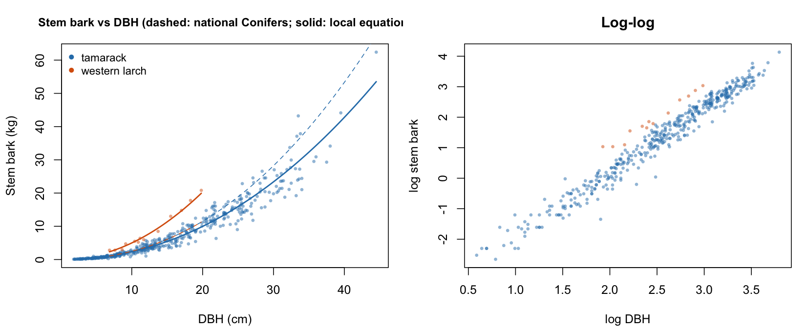
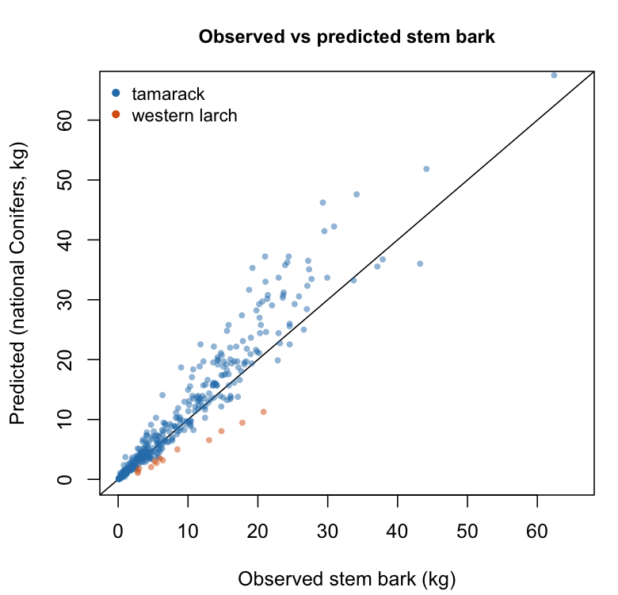
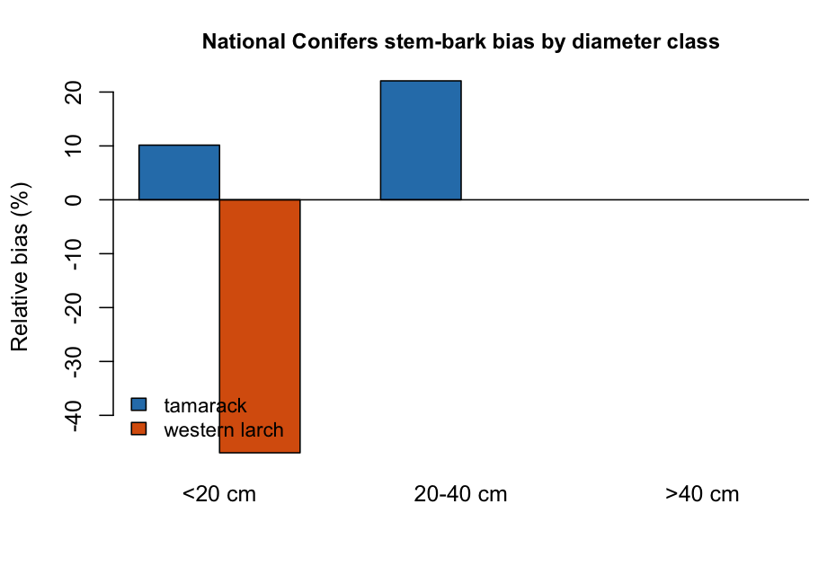
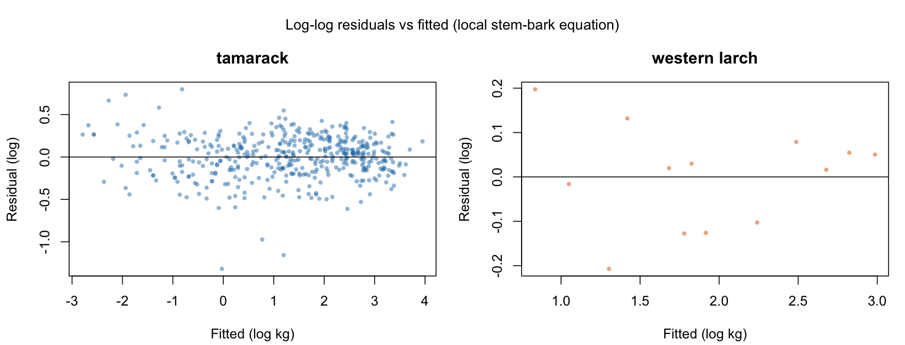
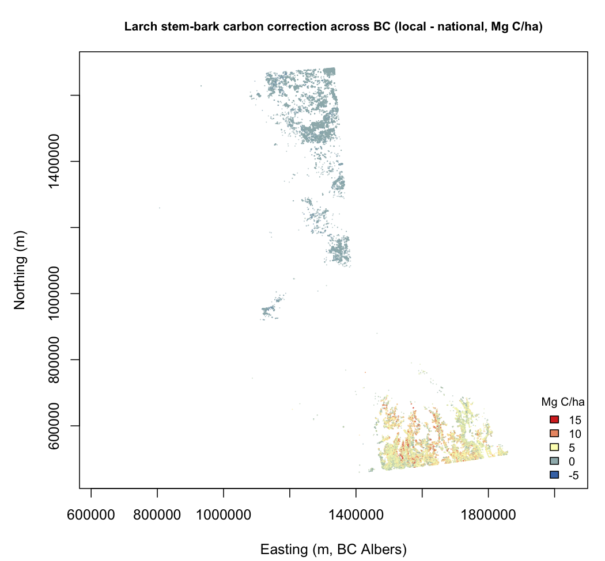
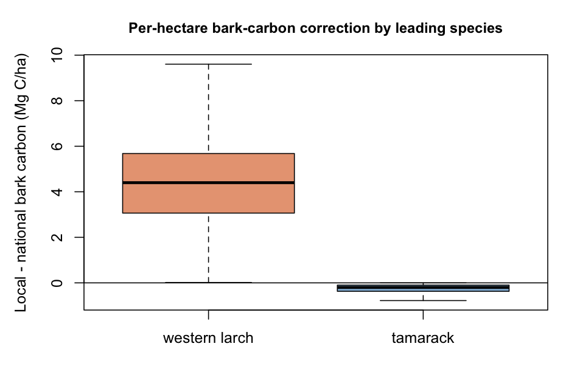
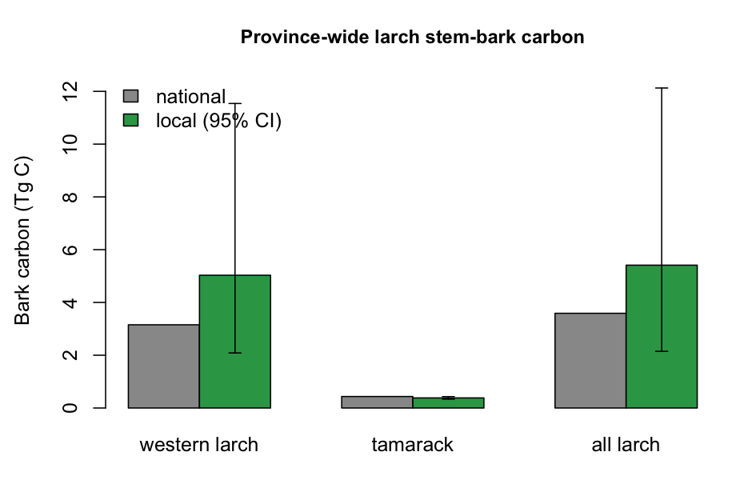

```{r}
#| label: setup
#| echo: false
#| output: false
# Rendering this manuscript runs the entire analysis. Every table and figure below is
# produced by the R code in the Results section below, so the document cannot drift
# from the numbers. Nothing is fetched over the network: all four inputs are cached in 02.inputs.
library(knitr)
knitr::opts_chunk$set(echo = TRUE, warning = FALSE, message = FALSE)

repo <- normalizePath("..")
TBL  <- file.path(repo, "03.outputs", "tables")
FIG  <- file.path(repo, "03.outputs", "figures")
dir.create(TBL, recursive = TRUE, showWarnings = FALSE)
dir.create(FIG, recursive = TRUE, showWarnings = FALSE)

IN2CM <- 2.54; FT2M <- 0.3048; LB2KG <- 0.453592   # LegacyTreeData is imperial
CFRAC <- 0.47                                      # IPCC carbon fraction of dry biomass
COMPS <- c("Wood", "Bark", "Branches", "Foliage")  # national component set
SPORD <- c("tamarack", "western larch")

nz  <- function(x) suppressWarnings(as.numeric(x))
tbl <- function(f) read.csv(file.path(TBL, f))

# Accuracy metrics used throughout: MAE, RMSE and R squared, each error term also
# expressed relative to the observed mean as a percentage. Relative bias is
# 100(predicted - observed)/observed, so a negative value denotes underestimation.
metrics <- function(obs, prd) {
  obs <- as.numeric(obs); prd <- as.numeric(prd)
  m <- is.finite(obs) & is.finite(prd); obs <- obs[m]; prd <- prd[m]
  if (length(obs) < 2)
    return(list(n = length(obs), mean_obs = NA, bias = NA, rel_bias = NA,
                mae = NA, rel_mae = NA, rmse = NA, rel_rmse = NA, r2 = NA))
  e <- prd - obs
  ss_res <- sum(e^2); ss_tot <- sum((obs - mean(obs))^2)
  list(n = length(obs), mean_obs = mean(obs), bias = mean(e),
       rel_bias = 100 * sum(e) / sum(obs),
       mae = mean(abs(e)), rel_mae = 100 * mean(abs(e)) / mean(obs),
       rmse = sqrt(mean(e^2)), rel_rmse = 100 * sqrt(mean(e^2)) / mean(obs),
       r2 = if (ss_tot > 0) 1 - ss_res / ss_tot else NA)
}

# population (biased) third and fourth moments, the convention of the reported statistics
skew_p <- function(x) { m <- mean(x); s <- sqrt(mean((x - m)^2)); mean((x - m)^3) / s^3 }
kurt_p <- function(x) { m <- mean(x); s <- sqrt(mean((x - m)^2)); mean((x - m)^4) / s^4 - 3 }

# ordinary least squares with the standard error and p-value of the slope
linreg <- function(x, y) {
  n <- length(x); sx <- sum((x - mean(x))^2)
  b <- sum((x - mean(x)) * (y - mean(y))) / sx
  a <- mean(y) - b * mean(x)
  r <- y - (a + b * x); see <- sqrt(sum(r^2) / (n - 2)); se <- see / sqrt(sx)
  list(slope = b, intercept = a, stderr = se, n = n,
       r = cor(x, y), p = 2 * pt(-abs(b / se), n - 2))
}

# shared table formatters
sp   <- function(x) unname(c(`tamarack` = "Tamarack",
                            `western larch` = "Western larch",
                            `all larch` = "All larch")[x])
fp   <- function(p) ifelse(p < 0.001, "<0.001", sprintf("%.3f", p))
cnt  <- function(x) formatC(round(x), format = "d", big.mark = ",")
tg   <- function(x) ifelse(abs(x) < 1, sprintf("%.2f", x), sprintf("%.1f", x))
dash <- function(x, f) ifelse(is.na(x), "-", sprintf(f, x))
```

## Abstract {.unnumbered}

Generalized national allometric equations give carbon accounting transferable biomass estimates where local destructive equations are missing, at a known cost in accuracy for under-represented taxa and components. Stem bark is such a component in the larches, whose two North American species differ sharply in bark investment. We evaluated Canada's national stem-bark coefficients against destructively measured bark mass for tamarack (*Larix laricina)* and western larch (*Larix occidentalis*). Western larch has no national coefficient, so its bark comes from the generic conifer coefficient, which underestimated it by 47 percent; a fitted western-larch equation cut cross-validated relative error from 56 to 9 percent, with an R squared of 0.99. The same coefficient over-predicted tamarack by 19 percent, increasingly with size, while tamarack's own coefficient was near unbiased. Stem bark is 18.9 percent of stem mass in western larch against 11.5 percent in tamarack, so the two depart in opposite directions: a species-specific coefficient is warranted, a genus-pooled one is not. Independent stem-taper trees, sharing no individuals with the mass sample and reaching 39.4 cm, confirmed the divergence: bark occupied 24.4 against 13.3 percent of the stem cross-section, and scaled with diameter to the power 2.56 against 1.36, so bark's share rises with size in one species and falls in the other. Applying both equations across 67,409 larch-leading polygons of the British Columbia Vegetation Resources Inventory raised western-larch stem-bark carbon from 3.15 to 5.03 teragrams, 60 percent over 376,000 hectares, while tamarack fell 12 percent. An independently published equation fitted to 105 cm gave 4.31 teragrams, bracketing the correction at 37 to 60 percent; it exceeds ours above 45 cm, so our extrapolation is the conservative one in the large trees that hold most stand carbon.

# Introduction

Allometric equations are the foundation of forest biomass and carbon estimation. Because destructive measurement is impractical at operational scale, inventories convert measured tree dimensions, principally diameter at breast height (DBH), into component and total biomass through fitted allometric relationships, and every reported carbon stock ultimately rests on that conversion [@vorster2020]. The equations vary in taxonomic and geographic scope, from local species-specific models to generalized national models applied across many species. Most take the power form relating component or total mass to diameter, and large compilations catalogue hundreds to thousands of such equations for North America and Europe, including separate equations for stem bark, while also showing that many rest on few sites and small samples [@termikaelian1997; @zianis2005]. Generalized national equations such as Canada's national biomass equations [@lambert2005; @ung2008] exist precisely because local destructive equations are unavailable for most species and places, and gain breadth by grouping species by taxon and wood specific gravity rather than fitting each separately [@chojnacky2014]. Canada's set was fitted to 8,636 destructively sampled trees across 33 species [@lambert2005] and re-estimated with British Columbia data added [@ung2008], with the components of each tree constrained to sum to total biomass by nonlinear seemingly-unrelated regression, so the estimates are internally consistent and transferable, and they are embedded in national carbon accounting and operational provincial inventories.

That generality carries a recognized cost. Pooling across species and regions reduces accuracy and widens uncertainty for populations under-represented in the calibration. In west-central Canada average prediction error rose from 9 to 12 to 25 kg per tree as equations generalized from local to regional to national, and national equations were statistically indistinguishable from local ones for only five of ten species [@case2008]. In northwestern Alberta the diameter-based national equations underestimated white spruce aboveground biomass while the diameter-and-height forms overestimated aspen and underestimated spruce [@xing2019]. Allometric equation choice can contribute between 30 and 75 percent of total uncertainty in landscape biomass maps, rivalling or exceeding remote-sensing error [@vorster2020; @ahmed2013], and the coefficients are sensitive to the fitting procedure, so both the equation and its statistics warrant scrutiny [@sileshi2014; @temesgen2015]. These findings do not indict generalized equations, which perform acceptably for most species; they establish that the trade-off is species and context specific and must be evaluated where a population departs from the calibration norm.

Two features of that trade-off matter here. First, whole-tree accuracy can conceal component-level bias. In eastern Canadian open woodlands the national equations predicted whole-tree biomass of black spruce and jack pine accurately yet underestimated the branch component [@fradette2021]; in western Canadian peatlands they underestimated small black spruce, and a stratum-specific model removed most of the bias [@wagers2024]; and component-resolved larch work shows that fitting separate equations for stem wood, stem bark, branches, and foliage reveals departures a total-biomass comparison would miss [@delcourt2022]. Second, bias concentrates where morphology or size departs from the calibration population, because component mass follows a power of diameter and error is largest at or beyond the calibration range.

Western larch (*Larix occidentalis*) is a clear case of both departures. It is a deciduous conifer, shade-intolerant, among the fastest-growing and most fire-resistant trees of the northwestern montane forests, attaining large diameters into the tail of, or beyond, national calibration ranges. Its crown is atypical of the evergreen conifers that dominate that calibration, with foliage scaling nearly linearly with diameter through a long crown [@williams2017] and depending on stand structure [@dirnberger2017]. Most relevant here, western larch develops among the thickest bark of any North American conifer, an adaptation to frequent low-intensity fire; bark allocation is a fire-adaptation trait that varies among taxa, with fire-adapted species allocating proportionally more stem diameter to bark than co-occurring thinner-barked taxa [@singh2022], so a coefficient pooled across mostly thinner-barked conifers encodes a bark allocation western larch does not share. The genus is not uniform in this. Tamarack (*Larix laricina*), the only larch the national system fits and the sole larch congener available as a substitute, is a boreal species of different form and thinner bark, so the two North American larches plausibly sit on opposite sides of the conifer-pool bark allocation. That contrast is the axis this paper turns on.

Stem bark deserves attention as a pool in its own right, not only as a term in total biomass. It is dense, nutrient-poor, slow to decompose, and persistent in harvest residues and on the forest floor, so it behaves differently from wood or foliage in carbon budgets and in volume-to-biomass conversion. In thick-barked species it is a large share of stem mass rather than a rounding term, and that share is not fixed: bark thickness increases with tree size, and in fire-adapted larches the insulating outer rhytidome keeps accruing as boles enlarge [@zhu2024]. A coefficient encoding an average conifer bark allocation therefore misrepresents a thick-barked species in a way that should grow with diameter and concentrate in the large trees that hold most stand carbon [@lutz2018; @mildrexler2020]. Foliage, by contrast, is a small, seasonally shed fraction in a deciduous conifer, so a large relative error there changes little stand carbon; bark is the component where a species-specific departure is both mechanistically expected and materially consequential.

The operational stakes are concrete in British Columbia, where western larch is commercially and ecologically important through the interior and the Interior Wetbelt, and where carbon is estimated with generalized inventory and national allometric tools. The errors of those tools are material: in the Interior Wetbelt the operational Vegetation Resources Inventory underestimated field-measured carbon by as much as seventy-five percent in the densest stands [@dellasala2022], and national biomass products continue to be evaluated and revised against independent plot data [@tompalski2026]. A component-level bias in a biomass-dominant pool of a commercially important species therefore bears directly on credible carbon accounting in British Columbia, and the province-wide inventory that carries the bias, updated annually, is the natural place to measure its consequence.

That consequence plays out through the operational inventory. British Columbia estimates forest carbon from its Vegetation Resources Inventory, a province-wide, photo-interpreted and ground-sampled record of stand attributes reissued annually and feeding provincial greenhouse-gas reporting, offset accounting, and land-use analysis. Biomass in that inventory is derived from stand volume through the national volume-to-biomass conversion [@boudewyn2007], so any bias in the underlying component relationships propagates to every hectare it reports. Whether a component-level bias in a single commercially important species is large enough to matter at that scale, and where it would fall, has not been asked. Because the inventory records leading species, diameter, and stems for every polygon, it is at once the place the bias matters and the instrument with which its consequence can be measured directly, without new fieldwork and at the resolution of the stands where offsets are increasingly sited.

Despite this, the adequacy of the national stem-bark coefficients for the larches has not been evaluated, nor the consequence of any error for carbon in British Columbia. We address this in two stages. In the first we evaluate the national stem-bark coefficients against destructive data for both larches, fit larch-specific equations, and test on independent stem-taper measurements whether bark allocation differs between the species and changes with tree size. In the second we apply the national and locally fitted equations across the British Columbia Vegetation Resources Inventory to quantify the consequence for British Columbia's larch bark carbon. We test four hypotheses. **H1**, the generic conifer coefficient, the operative national predictor for the unlisted western larch, underestimates western-larch stem bark, because western larch expresses a thick-bark fire-resistance syndrome [@feis_larocc; @pausas2015; @pellegrini2017] the pooled coefficient does not encode. **H2**, tamarack, the one larch the system fits, is not underestimated by its own coefficient, and the generic conifer coefficient over-predicts tamarack bark, so the larches do not share a single bias. **H3**, because the departures are opposite in sign, a species-specific western-larch bark coefficient is warranted and a genus-pooled one is not. **H4**, correcting the western-larch bias changes British Columbia's larch bark carbon by a non-negligible amount concentrated in the western-larch range.

# Study Area and Methods

We proceed in two parts. The first is a component-level accuracy and uncertainty assessment of the national coefficients against destructive data, with larch-specific equations fitted to it, following the metrics and diagnostics of @delcourt2022 and the accuracy-and-uncertainty framing of @xing2019. The second applies the resulting equations across the inventory of British Columbia, following the landscape assessment of @dellasala2022. Relative bias is defined as 100(predicted minus observed) divided by observed, so a negative value denotes underestimation.

## Biomass data

Four datasets are used, all open. Two carry destructively measured stem-bark mass and supply the accuracy assessment and the fitted equations; a third carries stem taper and supplies an independent test of bark allocation; the fourth is the operational forest inventory of British Columbia, across which the equations are applied.

Tamarack destructive records were drawn from the ENFOR programme [@enfor2017], the pan-Canadian destructive-biomass sample the national coefficients were fitted on. Because these are the calibration trees, the tamarack arm is an in-sample adequacy check. We retained the tamarack records carrying oven-dry stem-bark mass, diameter, and height, giving n = 439 to 44.5 cm DBH, stem bark complete for every record. The national fit drew 575 tamarack trees from this archive, and our 439 span its full reported extent, 1.8 to 44.5 cm DBH and 2.2 to 30.5 m in height [@lambert2005], so the tamarack arm tests the coefficient across the whole interval it was fitted on rather than a favourable part of it. Western larch measurements were drawn from LegacyTreeData [@radtke2021], an open repository (CC BY) of individual-tree destructive measurements; western larch is absent from the national species set, so these trees are independent of the coefficient under test. We retained trees with stem-bark dry weight and diameter, giving n = 13 from a single site, 6.9 to 19.8 cm DBH, with no height, so western larch is evaluated in the diameter-only form. Imperial units were converted to metric. Stem-bark component definitions differ in detail between the two sources and were reconciled as far as the metadata allow; residual difference is carried as a limitation. Stem wood and total aboveground biomass are assessed alongside stem bark for context. Sample sizes and extents are summarized in @tbl-descr.

LegacyTreeData also carries stem taper, paired outside-bark and inside-bark diameters measured at intervals up the stem. From the breast-height section, present in every record, we drew a second and independent sample: western larch n = 15 from the Umatilla National Forest, 16.3 to 39.4 cm DBH, and tamarack n = 42 from three sites, 12.2 to 31.5 cm. These trees share no individuals with the 13 bark-mass trees and reach the diameters the mass sample never does.

The national coefficients themselves are the fourth input. We take the operational parameterisation [@ung2008] rather than the original fit [@lambert2005], read from the national biomass calculator, in both the diameter-only and the diameter-and-height forms and for all four components (@tbl-coef).

The British Columbia Vegetation Resources Inventory (the VEG_COMP_LYR_R1_POLY layer) is the province-wide photo-interpreted and ground-sampled record of stand attributes, reissued annually and used for operational carbon accounting. Larch-leading polygons were retrieved from the BC Data Catalogue public web feature service, 51,400 western-larch-leading and 27,234 tamarack-leading, 78,634 in all; after dropping polygons with missing quadratic mean diameter, stems, or area, 67,409 were retained. Each polygon records quadratic mean diameter (QMD, cm), live stems per hectare, height, age, biogeoclimatic zone, area, and a volume-based estimate of stem-bark biomass.

## Development of allometric equations

The national equations [@lambert2005; @ung2008] estimate each component in a power of diameter, mass = b~1~D^b~2~^, and of diameter and height, mass = b~1~D^b~2~^H^b~3~^, fitted by nonlinear seemingly-unrelated regression with additivity. The operational parameterisation fits 41 named species plus the generic classes coniferous, deciduous, and all species, and it is the later estimate [@ung2008] rather than the original 33-species fit [@lambert2005]; the two are not interchangeable in the generic class we rely on, whose stem-bark coefficient moved from a = 0.0162, b = 2.1959 to a = 0.0153, b = 2.2110. We evaluate the operational values, taken from the national biomass calculator. Western larch is not fitted and its only congener is tamarack, so western-larch bark is obtained from the generic conifer coefficient, which we treat as the operative national predictor and evaluate together with the tamarack coefficient as the nearest-congener substitute (@tbl-coef). For every tree we compared prediction with observation and summarized departure by relative bias, mean absolute error, root mean square error, each also expressed relative to the observed mean, and the coefficient of determination, overall and within diameter classes (below 20, 20 to 40, above 40 cm). Because the western-larch sample is small, we placed a bootstrap 95 percent interval on its relative bias by resampling the 13 trees 5000 times, and we report each species' stem-bark fraction as a mechanistic summary. To ask whether a fitted larch equation improves on the national one, and whether the genus can be pooled, we fitted stem-bark equations of the same power form two ways: log-log ordinary least squares with the Baskerville-Sprugel back-transformation correction [@sprugel1983], and weighted nonlinear least squares with residuals weighted by DBH\^2c to treat non-constant variance, the variance exponent c estimated from the residuals [@delcourt2022]. Fits were evaluated out of sample by cross-validation, ten-fold for tamarack and leave-one-out for the small western-larch sample, and the response and residuals were tested for normality by Shapiro-Wilk.

```{r}
#| label: national-coefficients
#| echo: true
#| output: false
cf_dbh  <- read.csv(file.path(repo, "02.inputs/larch/nfi_tree-level_allometric_dbh.csv"),
                    fileEncoding = "latin1")
cf_dbhh <- read.csv(file.path(repo, "02.inputs/larch/nfi_tree-level_allometric_dbh-height.csv"),
                    fileEncoding = "latin1")
COEF <- new.env(parent = emptyenv())
for (i in seq_len(nrow(cf_dbh)))
  assign(paste(cf_dbh$Species[i], "dbh", cf_dbh$Component[i]),
         c(cf_dbh$a[i], cf_dbh$b[i], NA), envir = COEF)
for (i in seq_len(nrow(cf_dbhh)))
  assign(paste(cf_dbhh$Species[i], "dbhh", cf_dbhh$Component[i]),
         c(cf_dbhh$a[i], cf_dbhh$b[i], cf_dbhh$c[i]), envir = COEF)
cget <- function(sp, form, comp) get(paste(sp, form, comp), envir = COEF)

# mass = a D^b in the diameter-only form, a D^b H^c with height
pred_comp <- function(sp, form, comp, d, h) {
  p <- cget(sp, form, comp)
  if (form == "dbh") p[1] * d^p[2]
  else if (!is.null(h) && !is.na(h)) p[1] * d^p[2] * h^p[3] else NA_real_
}
pred <- function(sp, form, comp, d, h) {
  if (comp == "total") return(sum(vapply(COMPS, function(k) pred_comp(sp, form, k, d, h), 0)))
  pred_comp(sp, form, c(bark = "Bark", wood = "Wood")[[comp]], d, h)
}

T2 <- do.call(rbind, lapply(c("Conifers", "Tamarack larch"), function(s)
  do.call(rbind, lapply(c("dbh", "dbhh"), function(form)
    do.call(rbind, lapply(COMPS, function(comp) {
      p <- cget(s, form, comp)
      data.frame(coefficient = s, form = ifelse(form == "dbh", "DBH", "DBH+H"),
                 component = comp, a = p[1], b = p[2], c = p[3])
    }))))))
write.csv(T2, file.path(TBL, "T2_national_coefficients.csv"), row.names = FALSE)
```

```{r}
#| label: tbl-coef
#| echo: true
#| tbl-cap: "National stem-bark coefficients evaluated [@lambert2005; @ung2008]. Western larch has none and is estimated through the generic conifer coefficient."
co <- tbl("T2_national_coefficients.csv")
co <- co[co$component == "Bark", ]
co <- co[order(co$form, co$coefficient != "Conifers"), ]
kable(data.frame(
  Coefficient = ifelse(co$coefficient == "Conifers", "Conifers (generic)", "Tamarack"),
  Form        = co$form,
  `Bark a`    = sprintf("%.4f", co$a),
  `Bark b`    = sprintf("%.4f", co$b),
  `Bark c`    = dash(co$c, "%.4f"),
  check.names = FALSE), align = "llrrr")
```

## Bark geometry from stem taper

The western-larch bark-mass sample stops at 19.8 cm while the inventory it is applied to averages 32 cm, so the exponent, which governs the extrapolation, cannot be tested on the mass data alone. LegacyTreeData also carries stem taper with paired outside-bark and inside-bark diameters, from which bark allocation can be measured directly on larger trees. We extracted the section at breast height, present in every record, for both larches: western larch n = 15 from the Umatilla National Forest, 16.3 to 39.4 cm DBH, and tamarack n = 42 from three sites, 12.2 to 31.5 cm. The western-larch taper trees share no individuals with the 13 bark-mass trees and begin where the mass sample ends, so they form an independent second sample covering the diameter range the bark-mass sample lacks. For each tree we computed double bark thickness, and bark's share of the stem cross-section as 1 minus the squared ratio of inside-bark to outside-bark diameter, the geometric analogue of bark's share of stem mass. Species were compared overall and within their overlapping diameter band so the contrast is not confounded with size, by Welch's test with a bootstrap interval on each mean. Size-dependence was assessed by the trend in bark share with diameter and by fitting bark cross-sectional area as a power of diameter, where an exponent above two means bark's share rises with size and an exponent of two means it is constant. Because these samples are small and western larch comes from one site, both the trend and the exponent were refitted leaving each tree out in turn, and the association was also checked by Spearman correlation. This analysis uses measured diameters only, with no assumed bark density, so it speaks to bark geometry and not directly to bark mass.

## Application to the forest inventory

We applied the national and locally fitted equations across the British Columbia Vegetation Resources Inventory (the VEG_COMP_LYR_R1_POLY layer of the government forest-vegetation inventory), the province-wide photo-interpreted inventory updated annually and used for operational carbon accounting. Larch-leading polygons were retrieved from the BC Data Catalogue public web feature service, 51,400 western-larch-leading and 27,234 tamarack-leading, 78,634 in all; after dropping polygons with missing quadratic mean diameter, stems, or area, 67,409 were retained. For each polygon the inventory records quadratic mean diameter (QMD, cm), live stems per hectare, height, age, biogeoclimatic zone, area, and a volume-based estimate of stem-bark biomass. Stem bark per hectare was computed as stems per hectare multiplied by bark(QMD), under the national generic conifer equation and under the species-specific local equation, western larch on western-larch-leading polygons and tamarack on tamarack-leading polygons. Both equations receive the identical QMD treatment, so their difference isolates the equation effect. Applying a convex power at the quadratic mean diameter is a first-order stand approximation that under-represents the diameter distribution, but it is applied identically to both equations, so the correction ratio is robust while absolute levels are approximate. Biomass was converted to carbon with a fraction of 0.47. Uncertainty in the local equation was propagated to the British Columbia totals by Monte Carlo, drawing the local equation parameters from their fitted distributions over 1000 iterations to give a 95 percent interval. As an independent check we compared our national stand-level estimate with the inventory's own volume-based bark biomass (the national volume-to-biomass procedure of @boudewyn2007). The per-hectare correction was mapped across the province using polygon label centroids in the provincial Albers projection.

## Published comparison equation

Our western-larch equation is fitted below 20 cm, so we sought a published equation calibrated across the operational range as an external check. @affleck2019 fitted stembark equations for the predominant Inland Northwest conifers within a 470-tree destructive sample spanning 5 to 105 cm DBH, including western larch on 36 stembark observations, in the form mass = 0.001910 D^1.636^H^1.332^ (kg, D in cm, H in m). It is calibrated on the size range ours lacks, drawn from the same regional population, and independent of both the national coefficients and our local equation. We applied it at the tree level across the diameter range and province-wide alongside the national and locally fitted equations, taking height from the inventory's projected height, which is recorded for every larch-leading polygon. One definitional difference must be carried through the interpretation: Affleck's stembark runs from a 30 cm stump to a 5 cm top, whereas the ENFOR and LegacyTreeData components include the stump and run to the tip. Because bark is proportionally thickest at the base and the 5 cm top truncation removes a large share of a small stem, the published equation is expected to sit low against a whole-stem definition, and most so in small trees, which is where the comparison should be given least weight.

# Results

## National equation accuracy

Tamarack comes from the ENFOR destructive archive, the national calibration data, so its arm is an in-sample check; western larch comes from LegacyTreeData in imperial units and is independent of the coefficient under test.

```{r}
#| label: destructive-data
#| echo: true
#| output: false
enfor <- read.csv(file.path(repo, "02.inputs/enfor/EnforCanadaBiomassFinalData_v2007-ENG.csv"),
                  fileEncoding = "latin1")
e <- enfor[grepl("tamarack", tolower(enfor$Species_E)), ]
TAM <- data.frame(sp = "tamarack", dbh = nz(e$Dbh), h = nz(e$Height),
                  bark = nz(e$OM_stem_bark), wood = nz(e$OM_stem_wood),
                  total = nz(e$OM_total))
TAM <- TAM[!is.na(TAM$dbh) & TAM$dbh != 0 & !is.na(TAM$bark), ]

tree <- read.csv(file.path(repo, "02.inputs/legacy-tree/tree.txt"), fileEncoding = "latin1")
w <- tree[tree$spcd == 73, ]                       # 73 = Larix occidentalis
WL <- data.frame(sp = "western larch", dbh = nz(w$st_ob_d_bh) * IN2CM, h = NA_real_,
                 bark = nz(w$st_bk_dw) * LB2KG, wood = nz(w$st_wd_dw) * LB2KG,
                 total = nz(w$ag_dw) * LB2KG)
WL <- WL[!is.na(WL$dbh) & WL$dbh != 0 & !is.na(WL$bark), ]

descr <- function(rows, key) {
  v <- rows[[key]]; v <- v[!is.na(v)]
  if (!length(v)) return(data.frame(n = 0, mean = NA, sd = NA, min = NA, max = NA))
  data.frame(n = length(v), mean = mean(v), sd = if (length(v) > 1) sd(v) else NA,
             min = min(v), max = max(v))
}
T1 <- do.call(rbind, lapply(list(list("tamarack (ENFOR)", TAM),
                                 list("western larch (LegacyTreeData)", WL)), function(z)
  do.call(rbind, lapply(list(c("dbh", "DBH (cm)"), c("h", "Height (m)"),
                             c("bark", "Stem bark (kg)"), c("wood", "Stem wood (kg)"),
                             c("total", "Total AGB (kg)")), function(kv)
    cbind(dataset = z[[1]], variable = kv[2], descr(z[[2]], kv[1]))))))
write.csv(T1, file.path(TBL, "T1_descriptive_stats.csv"), row.names = FALSE)
```

Accuracy is summarized by relative bias, relative RMSE and R squared, overall and within diameter classes, for both coefficient choices and both equation forms.

```{r}
#| label: accuracy
#| echo: true
#| output: false
classes <- function(rows) list(all = rows, `<20` = rows[rows$dbh < 20, ],
                               `20-40` = rows[rows$dbh >= 20 & rows$dbh < 40, ],
                               `>40` = rows[rows$dbh >= 40, ])
rows_t3 <- list()
for (z in list(list("tamarack", TAM), list("western larch", WL))) {
  spname <- z[[1]]; rows <- z[[2]]
  for (comp in c("bark", "wood", "total"))
    for (coefsp in c("Conifers", "Tamarack larch"))
      for (form in c("dbh", "dbhh")) {
        # western larch carries no height, so it is evaluated in the DBH form only
        if (form == "dbhh" && !any(!is.na(rows$h) & rows$h != 0)) next
        for (cls in names(classes(rows))) {
          sub <- classes(rows)[[cls]]
          if (!nrow(sub)) next
          prd <- vapply(seq_len(nrow(sub)), function(i)
            as.numeric(pred(coefsp, form, comp, sub$dbh[i], sub$h[i])), 0)
          rows_t3[[length(rows_t3) + 1]] <- data.frame(
            species = spname, component = comp, coefficient = coefsp,
            form = ifelse(form == "dbh", "DBH", "DBH+H"), dbh_class = cls,
            as.data.frame(metrics(sub[[comp]], prd)))
        }
      }
}
T3 <- do.call(rbind, rows_t3)
write.csv(T3, file.path(TBL, "T3_accuracy_national.csv"), row.names = FALSE)

# the western-larch sample is 13 trees, so its relative bias carries a bootstrap interval
set.seed(42)
NATB <- cget("Conifers", "dbh", "Bark")
wl_boot <- replicate(5000, {
  i <- sample(nrow(WL), nrow(WL), replace = TRUE)
  p <- NATB[1] * WL$dbh[i]^NATB[2]
  100 * sum(p - WL$bark[i]) / sum(WL$bark[i])
})
WL_BIAS_CI <- quantile(wl_boot, c(.025, .975))
WL_RATIO   <- range(WL$bark / (NATB[1] * WL$dbh^NATB[2]))

# stem-bark fraction of stem mass: the mechanism, measured directly
bark_frac <- function(r) { v <- 100 * r$bark / (r$bark + r$wood); v[is.finite(v)] }
BF <- lapply(list(tamarack = TAM, `western larch` = WL),
             function(r) c(mean = mean(bark_frac(r)), sd = sd(bark_frac(r))))
```

The local equation is done two ways, log-log OLS with the Baskerville-Sprugel correction and weighted nonlinear least squares, and judged out of sample: leave-one-out for the 13 western-larch trees, ten-fold for tamarack.

```{r}
#| label: local-equations
#| echo: true
#| output: false
loglog_fit <- function(d, y) {
  d <- as.numeric(d); y <- as.numeric(y)
  X <- cbind(1, log(d)); ly <- log(y)
  beta <- qr.solve(X, ly)
  resid <- ly - X %*% beta; n <- length(y)
  see <- sqrt(sum(resid^2) / (n - 2))
  se  <- sqrt(diag(see^2 * solve(t(X) %*% X)))
  cf  <- exp(see^2 / 2)                       # Baskerville-Sprugel correction
  m   <- metrics(y, cf * exp(X %*% beta))
  c(list(a = exp(beta[1]) * cf, b = unname(beta[2]),
         a_se = abs(exp(beta[1]) * cf) * se[1], b_se = se[2], cf = cf, see = see),
    setNames(m, paste0("fit_", names(m))))
}
wnls_fit <- function(d, y) {
  d <- as.numeric(d); y <- as.numeric(y)
  m0 <- nls(y ~ a * d^b, start = list(a = 0.02, b = 2.1),
            control = nls.control(maxiter = 200, warnOnly = TRUE))
  r0 <- y - fitted(m0); msk <- abs(r0) > 0
  # residual variance as a power of diameter: log(resid^2) ~ log(d), slope = 2c
  cvar <- unname(coef(lm(log(r0[msk]^2) ~ log(d[msk])))[2]) / 2
  m1 <- try(nls(y ~ a * d^b, start = as.list(coef(m0)), weights = 1 / (d^cvar)^2,
                control = nls.control(maxiter = 200, warnOnly = TRUE)), silent = TRUE)
  if (inherits(m1, "try-error")) m1 <- m0
  co <- summary(m1)$coefficients
  m  <- metrics(y, co[1, 1] * d^co[2, 1])
  c(list(a = co[1, 1], b = co[2, 1], a_se = co[1, 2], b_se = co[2, 2], c_var = cvar),
    setNames(m, paste0("fit_", names(m))))
}
array_split <- function(idx, k) {
  n <- length(idx); b <- n %/% k; x <- n %% k
  split(idx, rep(seq_len(k), times = c(rep(b + 1, x), rep(b, k - x))))
}
cv_refit <- function(rows, comp, national_sp = "Conifers") {
  d <- rows$dbh; y <- rows[[comp]]; n <- nrow(rows)
  k <- if (n < 30) n else 10                  # leave-one-out when the sample is small
  idx <- sample(seq_len(n))
  no <- npd <- rp <- numeric(0)
  for (fo in array_split(idx, k)) {
    fit <- loglog_fit(d[setdiff(idx, fo)], y[setdiff(idx, fo)])
    no  <- c(no, y[fo])
    npd <- c(npd, vapply(d[fo], function(dd)
      as.numeric(pred(national_sp, "dbh", comp, dd, NA)), 0))
    rp  <- c(rp, fit$a * d[fo]^fit$b)
  }
  list(nat = metrics(no, npd), ref = metrics(no, rp))
}
set.seed(42)
rows_t4 <- list()
for (z in list(list("tamarack", TAM), list("western larch", WL))) {
  spname <- z[[1]]; rows <- z[[2]]
  for (comp in c("bark", "wood", "total")) {
    ok <- rows[!is.na(rows[[comp]]), ]
    if (nrow(ok) < 5) next
    ll <- loglog_fit(ok$dbh, ok[[comp]]); wn <- wnls_fit(ok$dbh, ok[[comp]])
    cv <- cv_refit(ok, comp)
    base <- data.frame(species = spname, component = comp, N = nrow(ok),
                       dbh_min = min(ok$dbh), dbh_max = max(ok$dbh),
                       cv_nat_rel_bias = cv$nat$rel_bias, cv_nat_mae = cv$nat$mae,
                       cv_nat_rel_mae = cv$nat$rel_mae, cv_nat_rel_rmse = cv$nat$rel_rmse,
                       cv_refit_rel_bias = cv$ref$rel_bias, cv_refit_mae = cv$ref$mae,
                       cv_refit_rel_mae = cv$ref$rel_mae, cv_refit_rel_rmse = cv$ref$rel_rmse)
    rows_t4[[length(rows_t4) + 1]] <- cbind(data.frame(
      method = "log-log OLS (Baskerville-Sprugel)", a = ll$a, a_se = ll$a_se, b = ll$b,
      b_se = ll$b_se, c_var = NA, cf = ll$cf, mae = ll$fit_mae,
      rel_mae = ll$fit_rel_mae, rmse = ll$fit_rmse,
      rel_rmse = ll$fit_rel_rmse, r2 = ll$fit_r2), base)
    rows_t4[[length(rows_t4) + 1]] <- cbind(data.frame(
      method = "weighted NLS (DBH^2c)", a = wn$a, a_se = wn$a_se, b = wn$b,
      b_se = wn$b_se, c_var = wn$c_var, cf = NA, mae = wn$fit_mae,
      rel_mae = wn$fit_rel_mae, rmse = wn$fit_rmse,
      rel_rmse = wn$fit_rel_rmse, r2 = wn$fit_r2), base)
  }
}
T4 <- do.call(rbind, rows_t4)
write.csv(T4, file.path(TBL, "T4_larch_refits.csv"), row.names = FALSE)
```

The response and the residuals are tested for normality, which is what justifies the log-log form.

```{r}
#| label: normality
#| echo: true
#| output: false
rows_t5 <- list()
for (z in list(list("tamarack", TAM), list("western larch", WL))) {
  spname <- z[[1]]; rows <- z[[2]]
  y <- rows$bark; d <- rows$dbh
  fit <- loglog_fit(d, y)
  resid <- as.numeric(log(y) - log(fit$a / fit$cf) - fit$b * log(d))
  for (lv in list(list("stem bark (kg)", y), list("log stem bark", log(y)),
                  list("log-log residuals", resid))) {
    v <- lv[[2]]; sw <- shapiro.test(v)
    rows_t5[[length(rows_t5) + 1]] <- data.frame(
      species = spname, variable = lv[[1]], n = length(v), mean = mean(v), sd = sd(v),
      se = sd(v) / sqrt(length(v)), skew = skew_p(v), kurtosis = kurt_p(v),
      shapiro_W = unname(sw$statistic), shapiro_p = sw$p.value)
  }
}
T5 <- do.call(rbind, rows_t5)
write.csv(T5, file.path(TBL, "T5_normality.csv"), row.names = FALSE)
```

```{r}
#| label: figures-accuracy
#| echo: true
#| output: false
col <- c(tamarack = "#2c7fb8", `western larch` = "#d95f0e")
barkfit <- lapply(list(tamarack = TAM, `western larch` = WL),
                  function(r) loglog_fit(r$dbh, r$bark))

png(file.path(FIG, "F1_bark_vs_dbh.png"), width = 11, height = 4.5, units = "in", res = 150)
par(mfrow = c(1, 2), mar = c(4.2, 4.2, 3, 1))
plot(NA, xlim = range(c(TAM$dbh, WL$dbh)), ylim = range(c(TAM$bark, WL$bark)),
     xlab = "DBH (cm)", ylab = "Stem bark (kg)", cex.main = 0.95,
     main = "Stem bark vs DBH (dashed: national Conifers; solid: local equation)")
for (s in names(col)) {
  r <- if (s == "tamarack") TAM else WL
  points(r$dbh, r$bark, pch = 16, cex = .6, col = adjustcolor(col[s], .5))
  xs <- seq(min(r$dbh), max(r$dbh), length.out = 100)
  lines(xs, NATB[1] * xs^NATB[2], lty = 2, col = col[s])
  lines(xs, barkfit[[s]]$a * xs^barkfit[[s]]$b, lwd = 1.8, col = col[s])
}
legend("topleft", names(col), col = col, pch = 16, bty = "n", cex = .9)
plot(NA, xlim = log(range(c(TAM$dbh, WL$dbh))), ylim = log(range(c(TAM$bark, WL$bark))),
     xlab = "log DBH", ylab = "log stem bark", main = "Log-log")
for (s in names(col)) {
  r <- if (s == "tamarack") TAM else WL
  points(log(r$dbh), log(r$bark), pch = 16, cex = .6, col = adjustcolor(col[s], .5))
}
dev.off()

png(file.path(FIG, "F2_obs_vs_pred.png"), width = 5.2, height = 5, units = "in", res = 150)
par(mar = c(4.2, 4.2, 3, 1))
lim <- c(0, max(c(TAM$bark, WL$bark)) * 1.05)
plot(NA, xlim = lim, ylim = lim, xlab = "Observed stem bark (kg)", cex.main = 0.95,
     ylab = "Predicted (national Conifers, kg)", main = "Observed vs predicted stem bark")
abline(0, 1, lwd = 1)
for (s in names(col)) {
  r <- if (s == "tamarack") TAM else WL
  points(r$bark, NATB[1] * r$dbh^NATB[2], pch = 16, cex = .7, col = adjustcolor(col[s], .5))
}
legend("topleft", names(col), col = col, pch = 16, bty = "n", cex = .9)
dev.off()

png(file.path(FIG, "F3_relbias_by_class.png"), width = 6.2, height = 4.2, units = "in", res = 150)
par(mar = c(4.2, 4.2, 3, 1))
clab <- c("<20", "20-40", ">40")
M <- sapply(list(TAM, WL), function(r) vapply(clab, function(cl) {
  sub <- classes(r)[[cl]]
  if (!nrow(sub)) return(NA_real_)
  metrics(sub$bark, NATB[1] * sub$dbh^NATB[2])$rel_bias
}, 0))
barplot(t(M), beside = TRUE, col = col, names.arg = paste(clab, "cm"), cex.main = .95,
        ylab = "Relative bias (%)", main = "National Conifers stem-bark bias by diameter class")
abline(h = 0); legend("bottomleft", names(col), fill = col, bty = "n", cex = .9)
dev.off()

png(file.path(FIG, "F4_residuals.png"), width = 11, height = 4.2, units = "in", res = 150)
par(mfrow = c(1, 2), mar = c(4.2, 4.2, 3, 1), oma = c(0, 0, 2, 0))
for (s in names(col)) {
  r <- if (s == "tamarack") TAM else WL
  f <- barkfit[[s]]
  fitted_ <- log(f$a / f$cf) + f$b * log(r$dbh)
  plot(fitted_, log(r$bark) - fitted_, pch = 16, cex = .7, col = adjustcolor(col[s], .5),
       xlab = "Fitted (log kg)", ylab = "Residual (log)", main = s)
  abline(h = 0)
}
mtext("Log-log residuals vs fitted (local stem-bark equation)", outer = TRUE, cex = 1.05)
dev.off()
```

The two destructive samples span very different sizes: tamarack to 44.5 cm DBH with height, western larch a small single-site sample to 19.8 cm without height (@tbl-descr). Against these, the internal control behaved as required. Applying the tamarack coefficient to its own ENFOR calibration trees recovered observed bark almost exactly, a relative bias of minus 0.6 percent, confirming the units and coefficient application.

```{r}
#| label: tbl-descr
#| echo: true
#| tbl-cap: "Destructive datasets and extents (stem bark; full table with height, wood, and total in the repository)."
d <- tbl("T1_descriptive_stats.csv")
d <- d[d$variable %in% c("DBH (cm)", "Stem bark (kg)"), ]
d$dataset <- sub("^tamarack", "Tamarack", sub("^western", "Western", d$dataset))
kable(data.frame(
  Dataset  = ifelse(duplicated(d$dataset), "", d$dataset),
  Variable = d$variable,
  n        = d$n,
  Mean     = sprintf("%.2f", d$mean),
  SD       = sprintf("%.2f", d$sd),
  Min      = sprintf("%.2f", d$min),
  Max      = sprintf("%.2f", d$max),
  check.names = FALSE), align = "llrrrrr")
```

Against that baseline the two larches diverged (@tbl-accuracy, @fig-f1, @fig-f2, @fig-f3). For western larch, evaluated independently, the generic conifer coefficient underestimated stem bark by 47.0 percent, with a bootstrap 95 percent interval of minus 49.3 to minus 45.1 percent; every one of the 13 trees carried between 1.7 and 2.6 times the predicted bark. Substituting the tamarack coefficient did not help and slightly worsened the gap, minus 53.8 percent, because tamarack carries even less bark than the conifer pool. Tamarack told the opposite story: the generic conifer coefficient over-predicted tamarack stem bark by 18.6 percent in the diameter-only form and 20.7 percent with height, and the over-prediction widened with diameter, from 10.1 percent below 20 cm to 22.1 percent at 20 to 40 cm, whereas tamarack's own coefficient was near unbiased. The mechanism is measured directly: stem bark is 18.9 percent (SD 3.0) of stem mass in western larch against 11.5 percent (SD 3.9) in tamarack, so western larch invests roughly 1.6 times the bark share of tamarack.

```{r}
#| label: tbl-accuracy
#| echo: true
#| tbl-cap: "Accuracy of the national coefficients for stem bark, excerpt (full species x component x class matrix in the repository). Negative denotes underestimation."
ac  <- tbl("T3_accuracy_national.csv")
ac  <- ac[ac$component == "bark", ]
key <- paste(ac$species, ac$coefficient, ac$form, ac$dbh_class)
ac  <- ac[match(c("tamarack Tamarack larch DBH+H all",
                  "tamarack Conifers DBH all",
                  "tamarack Conifers DBH 20-40",
                  "western larch Conifers DBH all",
                  "western larch Tamarack larch DBH all"), key), ]
kable(data.frame(
  Species       = sp(ac$species),
  Coefficient   = ifelse(ac$coefficient == "Conifers", "Conifers", "Tamarack"),
  Form          = ac$form,
  Class         = ac$dbh_class,
  n             = ac$n,
  `Rel. bias`   = sprintf("%+.1f%%", ac$rel_bias),
  MAE           = sprintf("%.2f", ac$mae),
  `Rel. MAE`    = sprintf("%.1f%%", ac$rel_mae),
  RMSE          = sprintf("%.2f", ac$rmse),
  `Rel. RMSE`   = sprintf("%.1f%%", ac$rel_rmse),
  R2            = sprintf("%.2f", ac$r2),
  check.names = FALSE), align = "llllrrrrrrr")
```

{#fig-f1}

{#fig-f2}

{#fig-f3}

## Larch-specific equations

A western-larch bark equation removed almost all of the error (@tbl-refit, @fig-f4). Cross-validated relative RMSE fell from 56.3 percent under the generic conifer coefficient to 9.3 percent under the local equation, with an R squared of 0.99; for tamarack the local equation improved cross-validated relative RMSE from 43.1 to 27.6 percent, though tamarack is already well served by its own national coefficient. The log-log and weighted-NLS fits agreed for tamarack, with a variance exponent near 1.8; for western larch the weighted-NLS variance term was unstable at n = 13, so the log-log fit is preferred there. The log transform normalized the western-larch response, which fails a Shapiro-Wilk test as raw mass (p = 0.03) but passes in the log-log residuals (p = 0.82), justifying the log-log form (@tbl-normal). For tamarack the large sample makes Shapiro-Wilk significant on small departures, but the residual skew and kurtosis are modest. Because the two species depart in opposite directions, a single pooled local equation averages an over-prediction against an underestimate and serves neither, so the species, not the genus, is the right level of correction.

```{r}
#| label: tbl-refit
#| echo: true
#| tbl-cap: "Local larch stem-bark equations (log-log with Baskerville-Sprugel and weighted NLS)."
rf <- tbl("T4_larch_refits.csv")
rf <- rf[rf$component == "bark", ]
kable(data.frame(
  Species     = sp(rf$species),
  Method      = ifelse(grepl("log-log", rf$method), "log-log OLS", "weighted NLS"),
  a           = sprintf("%.3f", rf$a),
  `a (SE)`    = sprintf("%.3f", rf$a_se),
  b           = sprintf("%.3f", rf$b),
  `b (SE)`    = sprintf("%.3f", rf$b_se),
  `c (var)`   = dash(rf$c_var, "%.2f"),
  MAE         = sprintf("%.2f", rf$mae),
  `Rel. MAE`  = sprintf("%.1f%%", rf$rel_mae),
  RMSE        = sprintf("%.2f", rf$rmse),
  `Rel. RMSE` = sprintf("%.1f%%", rf$rel_rmse),
  R2          = sprintf("%.2f", rf$r2),
  `CV rel. MAE national to local`  = sprintf("%.1f%% to %.1f%%",
                                             rf$cv_nat_rel_mae, rf$cv_refit_rel_mae),
  `CV rel. RMSE national to local` = sprintf("%.1f%% to %.1f%%",
                                             rf$cv_nat_rel_rmse, rf$cv_refit_rel_rmse),
  check.names = FALSE), align = "llrrrrrrrrrrll")
```

```{r}
#| label: tbl-normal
#| echo: true
#| tbl-cap: "Normality of the stem-bark response and residuals (Shapiro-Wilk)."
nm <- tbl("T5_normality.csv")
nm <- nm[nm$variable != "log stem bark", ]
kable(data.frame(
  Species     = sp(nm$species),
  Variable    = nm$variable,
  n           = nm$n,
  Skew        = sprintf("%.2f", nm$skew),
  Kurtosis    = sprintf("%.2f", nm$kurtosis),
  `Shapiro W` = sprintf("%.3f", nm$shapiro_W),
  `Shapiro p` = fp(nm$shapiro_p),
  check.names = FALSE), align = "llrrrrr")
```

{#fig-f4}

## Bark allocation

```{r}
#| label: taper-data
#| echo: true
#| output: false
SPP <- c(`73` = "western larch", `71` = "tamarack")
BH_FT <- 4.5                                       # breast height in the source units
stem <- read.csv(file.path(repo, "02.inputs/legacy-tree/stem.txt"), fileEncoding = "latin1")
larix <- unique(tree[tree$spcd %in% as.numeric(names(SPP)),
                     c("author", "loc", "spcd", "treeno")])
kf <- function(df) paste(df$author, df$loc, df$spcd, df$treeno, sep = "\r")
stem$st_ht <- nz(stem$st_ht)
bh <- stem[!is.na(stem$st_ht) & stem$st_ht == BH_FT, ]
bh <- bh[kf(bh) %in% kf(larix), ]
bh$st_ob_d <- nz(bh$st_ob_d); bh$st_ib_d <- nz(bh$st_ib_d)
bh <- bh[!is.na(bh$st_ob_d) & !is.na(bh$st_ib_d), ]
bh <- bh[!duplicated(kf(bh)), ]                    # one section per tree
bh$species <- SPP[as.character(bh$spcd)]
bh$dbh_ob  <- bh$st_ob_d * IN2CM                   # diameter outside bark, cm
bh$dbh_ib  <- bh$st_ib_d * IN2CM                   # diameter inside bark, cm
bh$dbt     <- bh$dbh_ob - bh$dbh_ib                # double bark thickness, cm
# bark's share of the cross-section: the geometric analogue of its share of stem mass
bh$f_area  <- 1 - (bh$dbh_ib / bh$dbh_ob)^2
bh$a_bark  <- (pi / 4) * (bh$dbh_ob^2 - bh$dbh_ib^2)   # bark cross-sectional area, cm^2
```

Species are contrasted overall and within the diameter band the two samples share, so the difference cannot be an artefact of the western-larch trees being larger. Bark area is then fitted as a power of diameter, where an exponent above two means bark's share rises with size.

```{r}
#| label: bark-geometry
#| echo: true
#| output: false
N_BOOT <- 10000
set.seed(20260721)
boot_ci <- function(x, fn, n = N_BOOT)
  quantile(replicate(n, fn(sample(x, length(x), replace = TRUE))), c(.025, .975))

T8 <- do.call(rbind, lapply(SPORD, function(s) {
  g <- bh[bh$species == s, ]; ci <- boot_ci(g$f_area, mean)
  data.frame(species = s, n = nrow(g), dbh_min = min(g$dbh_ob), dbh_max = max(g$dbh_ob),
             dbh_mean = mean(g$dbh_ob), dbt_mean = mean(g$dbt), dbt_sd = sd(g$dbt),
             f_area_mean = mean(g$f_area), f_area_sd = sd(g$f_area),
             f_area_lo = ci[1], f_area_hi = ci[2])
}))
write.csv(T8, file.path(TBL, "T8_bark_geometry.csv"), row.names = FALSE)

contrast <- function(d, label) {
  wl <- d$f_area[d$species == "western larch"]; tm <- d$f_area[d$species == "tamarack"]
  tt <- t.test(wl, tm)                             # Welch, unequal variances
  s  <- sqrt(((length(wl) - 1) * var(wl) + (length(tm) - 1) * var(tm)) /
               (length(wl) + length(tm) - 2))
  data.frame(comparison = label, n_wl = length(wl), n_tm = length(tm),
             f_wl = mean(wl), f_tm = mean(tm), ratio = mean(wl) / mean(tm),
             t = unname(tt$statistic), p = tt$p.value,
             cohens_d = (mean(wl) - mean(tm)) / s)
}
band <- c(max(tapply(bh$dbh_ob, bh$species, min)), min(tapply(bh$dbh_ob, bh$species, max)))
CONTRAST <- rbind(contrast(bh, "all sizes"),
                  contrast(bh[bh$dbh_ob >= band[1] & bh$dbh_ob <= band[2], ],
                           sprintf("%.1f-%.1f cm overlap", band[1], band[2])))

T9 <- do.call(rbind, lapply(SPORD, function(s) {
  g <- bh[bh$species == s, ]; n <- nrow(g)
  lr <- linreg(g$dbh_ob, g$f_area)                 # trend in bark share with diameter
  sl <- replicate(N_BOOT, { i <- sample(n, n, replace = TRUE)
                            linreg(g$dbh_ob[i], g$f_area[i])$slope })
  q  <- quantile(sl, c(.025, .975))
  sc <- linreg(log(g$dbh_ob), log(g$a_bark))       # bark area as a power of diameter
  tc <- qt(.975, n - 2); t_iso <- (sc$slope - 2) / sc$stderr
  # leave-one-out stability: a single influential tree must not carry the result
  loo <- t(vapply(seq_len(n), function(i) {
    m <- -i
    c(linreg(g$dbh_ob[m], g$f_area[m])$slope, linreg(g$dbh_ob[m], g$f_area[m])$p,
      linreg(log(g$dbh_ob[m]), log(g$a_bark[m]))$slope) }, numeric(3)))
  rho <- cor(g$dbh_ob, g$f_area, method = "spearman")
  t_rho <- rho * sqrt((n - 2) / (1 - rho^2))
  data.frame(species = s, slope = lr$slope, slope_lo = q[1], slope_hi = q[2],
             r = lr$r, p = lr$p, intercept = lr$intercept,
             scal_n = n, scal_a = exp(sc$intercept), scal_b = sc$slope,
             scal_b_se = sc$stderr, scal_b_lo = sc$slope - tc * sc$stderr,
             scal_b_hi = sc$slope + tc * sc$stderr, scal_r2 = sc$r^2,
             scal_t_vs_isometry = t_iso, scal_p_vs_isometry = 2 * pt(-abs(t_iso), n - 2),
             rob_loo_slope_min = min(loo[, 1]), rob_loo_slope_max = max(loo[, 1]),
             rob_loo_sign_stable = all(sign(loo[, 1]) == sign(loo[1, 1])),
             rob_loo_p_max = max(loo[, 2]), rob_loo_exponent_min = min(loo[, 3]),
             rob_loo_exponent_max = max(loo[, 3]),
             rob_loo_exponent_all_above_2 = min(loo[, 3]) > 2,
             rob_spearman_rho = rho, rob_spearman_p = 2 * pt(-abs(t_rho), n - 2))
}))
write.csv(T9, file.path(TBL, "T9_bark_area_scaling.csv"), row.names = FALSE)

# provenance: how many sites carry each species, recorded with the results
T8b <- do.call(rbind, lapply(split(bh, list(bh$species, bh$author, bh$loc), drop = TRUE),
  function(g) data.frame(species = g$species[1], author = g$author[1], loc = g$loc[1],
                         n = nrow(g), dbh_min = min(g$dbh_ob), dbh_max = max(g$dbh_ob),
                         f_area = mean(g$f_area))))
T8b <- T8b[order(T8b$species, T8b$author, T8b$loc), ]
write.csv(T8b, file.path(TBL, "T8b_bark_geometry_sites.csv"), row.names = FALSE)
```

```{r}
#| label: figure-geometry
#| echo: true
#| output: false
gcol <- c(`western larch` = "#d95f02", tamarack = "#1b9e77")
png(file.path(FIG, "F8_bark_geometry.png"), width = 11, height = 4.6, units = "in", res = 200)
par(mfrow = c(1, 2), mar = c(4.4, 4.4, 3, 1))
plot(bh$dbh_ob, 100 * bh$f_area, type = "n", cex.main = .98,
     xlab = "Diameter outside bark at breast height (cm)",
     ylab = "Bark share of stem cross-section (%)",
     main = "(a) Bark allocation against tree size")
usr <- par("usr"); rect(20, usr[3], 44, usr[4], col = adjustcolor("grey", .10), border = NA)
text(26, usr[4] * .99, "beyond the bark-mass sample", cex = .7, col = "grey40", adj = c(.5, 1))
abline(v = 32, lty = 3)
text(32.4, usr[3] + 1, "BC mean QMD", cex = .7, srt = 90, adj = 0)
for (s in names(gcol)) {
  g <- bh[bh$species == s, ]
  points(g$dbh_ob, 100 * g$f_area, pch = 16, col = adjustcolor(gcol[s], .85), cex = .9)
  tr <- linreg(g$dbh_ob, g$f_area)
  xx <- seq(min(g$dbh_ob), max(g$dbh_ob), length.out = 50)
  lines(xx, 100 * (tr$intercept + tr$slope * xx), col = gcol[s], lwd = 1.6)
}
legend("topleft", sprintf("%s (n = %d)", names(gcol),
                          as.integer(table(bh$species)[names(gcol)])),
       col = gcol, pch = 16, bty = "n", cex = .85)

plot(bh$dbh_ob, bh$a_bark, type = "n", log = "xy", cex.main = .98,
     xlab = "Diameter outside bark at breast height (cm)",
     ylab = expression("Bark cross-sectional area (cm"^2*")"),
     main = "(b) Scaling of bark area (isometry: b = 2)")
labs <- character(0)
for (s in names(gcol)) {
  g <- bh[bh$species == s, ]
  points(g$dbh_ob, g$a_bark, pch = 16, col = adjustcolor(gcol[s], .85), cex = .9)
  r <- T9[T9$species == s, ]
  xx <- seq(min(g$dbh_ob), max(g$dbh_ob), length.out = 50)
  lines(xx, r$scal_a * xx^r$scal_b, col = gcol[s], lwd = 1.6)
  labs <- c(labs, sprintf("%s: b = %.2f [%.2f, %.2f]", s, r$scal_b, r$scal_b_lo, r$scal_b_hi))
}
# isometric reference anchored on the pooled midpoint, so it is comparable
md <- median(bh$dbh_ob); ma <- median(bh$a_bark)
xx <- seq(min(bh$dbh_ob), max(bh$dbh_ob), length.out = 50)
lines(xx, ma * (xx / md)^2, lty = 2, lwd = 1.1)
legend("topleft", c(labs, "isometry (b = 2)"), col = c(gcol, "black"),
       lty = c(1, 1, 2), lwd = 1.6, bty = "n", cex = .8)
dev.off()
```

The taper sample reproduces the species divergence on trees that share no individuals with the bark-mass sample, and extends it past the size range the bark-mass sample could reach (@tbl-geom, @fig-f8). Bark occupies 24.4 percent of the stem cross-section at breast height in western larch (bootstrap 95 percent interval 21.5 to 27.5) against 13.3 percent in tamarack (12.3 to 14.4), a ratio of 1.83 (Welch t = 6.63, p \< 0.001, Cohen's d = 2.55). Restricted to the 16.3 to 31.5 cm band the two samples share, the ratio is unchanged at 1.84 (p \< 0.001), so the contrast is a property of the species and not of the western-larch trees being larger. The bark-mass sample gave a ratio of 1.64 on different trees at a different site; two independent samples and two different measurements give the same divergence. The area fractions exceed the bark-mass fractions for both species, 24.4 against 18.9 percent and 13.3 against 11.5 percent, as expected because bark is proportionally thickest near the base and differs from wood in density, so the two quantities agree in ratio and trend rather than in level.

```{r}
#| label: tbl-geom
#| echo: true
#| tbl-cap: "Bark geometry at breast height from stem taper (LegacyTreeData), an independent sample sharing no trees with the bark-mass data of @tbl-descr. Bark share of the cross-section is 1 minus the squared ratio of inside-bark to outside-bark diameter."
g  <- tbl("T8_bark_geometry.csv")
st <- tbl("T8b_bark_geometry_sites.csv")
g  <- g[order(g$species != "western larch"), ]
kable(data.frame(
  Species   = sp(g$species),
  Sites     = unname(sapply(g$species, function(s) sum(st$species == s))),
  n         = g$n,
  `DBH range (cm)` = sprintf("%.1f to %.1f", g$dbh_min, g$dbh_max),
  `Double bark thickness (cm)` = sprintf("%.2f (SD %.2f)", g$dbt_mean, g$dbt_sd),
  `Bark share of cross-section` = sprintf("%.1f%% (SD %.1f)", 100 * g$f_area_mean,
                                          100 * g$f_area_sd),
  `Bootstrap 95% CI` = sprintf("%.1f to %.1f%%", 100 * g$f_area_lo, 100 * g$f_area_hi),
  check.names = FALSE), align = "lrrlrrl")
```

The scaling of bark area answers the question the bark-mass data could not (@tbl-scaling). Bark cross-sectional area scales with diameter to the power 2.56 in western larch (95 percent interval 1.98 to 3.14) and 1.36 in tamarack (1.02 to 1.69). Isometry, an exponent of two, is the value at which bark's share of the stem stays constant as a tree grows. Western larch sits above it and tamarack significantly below (p \< 0.001), so bark's share of the stem rises with size in western larch and falls in tamarack. The direct trend in bark share carries the same signs, rising 0.46 percentage points per centimetre of diameter in western larch and falling 0.42 in tamarack, but the two are not equally secure: the tamarack decline is significant at every leave-one-out fit (worst p \< 0.001) across three sites, whereas the western-larch increase is suggestive rather than established, with a Spearman p of 0.11 and a worst leave-one-out p of 0.22 on 15 trees at a single site. The firmer western-larch statement is the exponent, which stayed above two in all fifteen leave-one-out fits, ranging 2.30 to 2.79.

```{r}
#| label: tbl-scaling
#| echo: true
#| tbl-cap: "Size-dependence of bark allocation. An exponent above two means bark's share of the stem rises with size; two is the isometric value at which it stays constant."
s <- tbl("T9_bark_area_scaling.csv")
s <- s[order(s$species != "western larch"), ]
kable(data.frame(
  Species = sp(s$species),
  `Trend in bark share (pp per cm)` = sprintf("%+.2f", 100 * s$slope),
  `Bootstrap 95% CI` = sprintf("%+.2f to %+.2f", 100 * s$slope_lo, 100 * s$slope_hi),
  `Spearman rho` = sprintf("%+.2f", s$rob_spearman_rho),
  p = fp(s$rob_spearman_p),
  `Bark area exponent b` = sprintf("%.2f", s$scal_b),
  `95% CI` = sprintf("%.2f to %.2f", s$scal_b_lo, s$scal_b_hi),
  `p vs isometry` = fp(s$scal_p_vs_isometry),
  `Leave-one-out b` = sprintf("%.2f to %.2f", s$rob_loo_exponent_min, s$rob_loo_exponent_max),
  check.names = FALSE), align = "lrlrrrlrl")
```

{#fig-f8}

## Carbon stocks

```{r}
#| label: inventory
#| echo: true
#| output: false
NAT <- c(0.0153, 2.2110)          # generic conifer stem bark, DBH form (Ung 2008)
refit_of <- function(s) {
  r <- T4[T4$species == s & T4$component == "bark" &
            startsWith(T4$method, "log-log"), ][1, ]
  c(a = r$a, b = r$b, a_se = r$a_se, b_se = r$b_se)
}
REF <- list(LW = refit_of("western larch"), LT = refit_of("tamarack"))

vri <- read.csv(file.path(repo, "02.inputs/vri/vri_larch.csv"))
n0 <- nrow(vri)
for (cc in c("QUAD_DIAM_125", "BASAL_AREA", "VRI_LIVE_STEMS_PER_HA", "PROJ_HEIGHT_1",
             "PROJ_AGE_1", "LIVE_STAND_VOLUME_125", "BARK_BIOMASS_PER_HA",
             "FEATURE_AREA_SQM", "LABEL_CENTRE_X", "LABEL_CENTRE_Y", "SPECIES_PCT_1"))
  vri[[cc]] <- nz(vri[[cc]])
vri$area_ha <- vri$FEATURE_AREA_SQM / 1e4
# stems/ha from the inventory, filled from basal area and QMD where it is missing
ba_per_tree <- pi * (vri$QUAD_DIAM_125 / 200)^2
vri$stems_ha <- ifelse(!is.na(vri$VRI_LIVE_STEMS_PER_HA) & vri$VRI_LIVE_STEMS_PER_HA > 0,
                       vri$VRI_LIVE_STEMS_PER_HA, vri$BASAL_AREA / ba_per_tree)
clean <- vri[vri$SPECIES_CD_1 %in% c("LW", "LT") & !is.na(vri$QUAD_DIAM_125) &
               vri$QUAD_DIAM_125 > 0 & !is.na(vri$stems_ha) & vri$stems_ha > 0 &
               !is.na(vri$area_ha) & vri$area_ha > 0, ]

bark_per_ha <- function(a, b, d, stems) stems * a * d^b / 1000       # Mg/ha
Q <- clean$QUAD_DIAM_125; S <- clean$stems_ha; A <- clean$area_ha
spc <- clean$SPECIES_CD_1
clean$bark_nat_MgHa <- bark_per_ha(NAT[1], NAT[2], Q, S)
clean$bark_ref_MgHa <- bark_per_ha(ifelse(spc == "LW", REF$LW["a"], REF$LT["a"]),
                                   ifelse(spc == "LW", REF$LW["b"], REF$LT["b"]), Q, S)
clean$barkC_nat_Mg <- clean$bark_nat_MgHa * A * CFRAC
clean$barkC_ref_Mg <- clean$bark_ref_MgHa * A * CFRAC
clean$dC_MgHa      <- (clean$bark_ref_MgHa - clean$bark_nat_MgHa) * CFRAC

T6 <- do.call(rbind, lapply(SPORD, function(s) {
  g <- clean[spc == c(tamarack = "LT", `western larch` = "LW")[s], ]
  data.frame(leading_species = s, n_polygons = nrow(g), area_ha = sum(g$area_ha),
             mean_QMD = mean(g$QUAD_DIAM_125),
             mean_height = mean(g$PROJ_HEIGHT_1, na.rm = TRUE),
             mean_age = mean(g$PROJ_AGE_1, na.rm = TRUE),
             mean_stems_ha = mean(g$stems_ha),
             mean_VRI_bark_MgHa = mean(g$BARK_BIOMASS_PER_HA, na.rm = TRUE))
}))
write.csv(T6, file.path(TBL, "T6_vri_resource.csv"), row.names = FALSE)
```

Local equation uncertainty is carried to the British Columbia totals by Monte Carlo. One parameter pair is drawn per species per iteration and applied province-wide, because the coefficient is a single uncertain quantity rather than an independent draw for each stand.

```{r}
#| label: bark-carbon
#| echo: true
#| output: false
set.seed(7)
mc_total <- function(mask, ndraw = 1000) {
  q <- Q[mask]; s <- S[mask]; a <- A[mask]; spm <- spc[mask]
  tot <- vapply(seq_len(ndraw), function(i) {
    aa <- ifelse(spm == "LW", rnorm(1, REF$LW["a"], REF$LW["a_se"]),
                 rnorm(1, REF$LT["a"], REF$LT["a_se"]))
    bb <- ifelse(spm == "LW", rnorm(1, REF$LW["b"], REF$LW["b_se"]),
                 rnorm(1, REF$LT["b"], REF$LT["b_se"]))
    sum(s * aa * q^bb / 1000 * a * CFRAC)
  }, 0)
  quantile(tot, c(.025, .975))
}
T7 <- do.call(rbind, lapply(list(list("western larch", spc == "LW"),
                                 list("tamarack", spc == "LT"),
                                 list("all larch", rep(TRUE, length(spc)))), function(z) {
  lab <- z[[1]]; mask <- z[[2]]
  natC <- sum(clean$barkC_nat_Mg[mask]); refC <- sum(clean$barkC_ref_Mg[mask])
  ci <- mc_total(mask)
  data.frame(leading_species = lab, area_ha = sum(A[mask]), national_barkC_Mg = natC,
             refit_barkC_Mg = refC, diff_Mg = refC - natC,
             diff_pct = 100 * (refC - natC) / natC,
             refit_CI95_lo = ci[1], refit_CI95_hi = ci[2])
}))
write.csv(T7, file.path(TBL, "T7_province_barkC.csv"), row.names = FALSE)

# independent cross-check against the inventory's own volume-based bark
ccx <- clean[!is.na(clean$BARK_BIOMASS_PER_HA), ]
VRI_R     <- cor(ccx$bark_nat_MgHa, ccx$BARK_BIOMASS_PER_HA)
VRI_RATIO <- sum(ccx$bark_nat_MgHa) / sum(ccx$BARK_BIOMASS_PER_HA)
```

```{r}
#| label: figures-inventory
#| echo: true
#| output: false
vcol <- c(LW = "#d95f0e", LT = "#2c7fb8")
png(file.path(FIG, "F5_perha_diff.png"), width = 6.2, height = 4.2, units = "in", res = 150)
par(mar = c(4, 4.6, 3, 1))
boxplot(list(`western larch` = clean$dC_MgHa[spc == "LW"],
             tamarack = clean$dC_MgHa[spc == "LT"]),
        col = adjustcolor(vcol, .6), outline = FALSE, cex.main = .95,
        ylab = "Local - national bark carbon (Mg C/ha)",
        main = "Per-hectare bark-carbon correction by leading species")
abline(h = 0)
dev.off()

png(file.path(FIG, "F6_province_map.png"), width = 7, height = 6.5, units = "in", res = 150)
par(mar = c(4.2, 4.6, 3, 1))
br  <- seq(-5, 15, length.out = 101)
pal <- colorRampPalette(c("#4575b4", "#ffffbf", "#d73027"))(100)
z   <- pmin(pmax(clean$dC_MgHa, -5), 15)
plot(clean$LABEL_CENTRE_X, clean$LABEL_CENTRE_Y, pch = 16, cex = .18, asp = 1,
     col = adjustcolor(pal[cut(z, br, include.lowest = TRUE)], .6), cex.main = .85,
     xlab = "Easting (m, BC Albers)", ylab = "Northing (m)",
     main = "Larch stem-bark carbon correction across BC (local - national, Mg C/ha)")
legend("bottomright", legend = c("15", "10", "5", "0", "-5"),
       fill = pal[c(100, 75, 50, 25, 1)], bty = "n", title = "Mg C/ha", cex = .8)
dev.off()

png(file.path(FIG, "F7_province_barkC.png"), width = 6.2, height = 4.2, units = "in", res = 150)
par(mar = c(4, 4.4, 3, 1))
M  <- rbind(national = T7$national_barkC_Mg / 1e6, refit = T7$refit_barkC_Mg / 1e6)
bp <- barplot(M, beside = TRUE, names.arg = T7$leading_species, cex.main = .95,
              col = c("#999999", "#31a354"), ylab = "Bark carbon (Tg C)",
              ylim = c(0, max(T7$refit_CI95_hi / 1e6) * 1.05),
              main = "Province-wide larch stem-bark carbon")
arrows(bp[2, ], T7$refit_CI95_lo / 1e6, bp[2, ], T7$refit_CI95_hi / 1e6,
       angle = 90, code = 3, length = .05)
legend("topleft", c("national", "local (95% CI)"), fill = c("#999999", "#31a354"), bty = "n")
dev.off()
```

The inventory holds 45,934 western-larch-leading polygons over 376,455 hectares and 21,475 tamarack-leading polygons over 162,543 hectares (@tbl-vri). The two resources differ in structure: western-larch stands average a quadratic mean diameter of 32 cm and a height of 26 m, tamarack 18 cm and 12 m. The western-larch mean diameter is well above the 20 cm ceiling of the destructive sample, so the western-larch local equation is extrapolated at province scale, a point we return to.

```{r}
#| label: tbl-vri
#| echo: true
#| tbl-cap: "British Columbia larch resource in the Vegetation Resources Inventory (larch-leading polygons, cleaned)."
vr <- tbl("T6_vri_resource.csv")
vr <- vr[order(vr$leading_species != "western larch"), ]
kable(data.frame(
  `Leading species`  = sp(vr$leading_species),
  Polygons           = cnt(vr$n_polygons),
  `Area (ha)`        = cnt(vr$area_ha),
  `Mean QMD (cm)`    = sprintf("%.1f", vr$mean_QMD),
  `Mean height (m)`  = sprintf("%.1f", vr$mean_height),
  `Mean stems/ha`    = sprintf("%.0f", vr$mean_stems_ha),
  `VRI bark (Mg/ha)` = sprintf("%.2f", vr$mean_VRI_bark_MgHa),
  check.names = FALSE), align = "lrrrrrr")
```

Applying the equations across the inventory, correcting the western-larch bark bias raised British Columbia's western-larch stem-bark carbon from 3.15 to 5.03 teragrams, an increase of 1.88 teragrams or 60 percent, while tamarack fell 12 percent, from 0.44 to 0.38 teragrams, for a net larch increase of 1.82 teragrams, near 51 percent (@tbl-province, @fig-f7). The correction is spatially coherent (@fig-f6): it concentrates in the southeast interior where western larch grows, reaching more than 15 megagrams of carbon per hectare in the densest western-larch stands, and is near zero for boreal tamarack in the northeast (@fig-f5). The Monte Carlo interval for western larch is wide, 2.1 to 11.5 teragrams, because the local equation rests on 13 small trees and is extrapolated to 32 cm stands, so the direction of the correction across British Columbia is secure but its magnitude is uncertain. As an independent check, our national stand-level estimate correlated with the inventory's own volume-based bark biomass at r = 0.78 and totalled 90 percent of it, supporting the stand-level approach and placing our national estimate slightly below the operational product.

```{r}
#| label: tbl-province
#| echo: true
#| tbl-cap: "Inventory-wide larch stem-bark carbon under the national coefficient and the local equation, with Monte Carlo intervals."
pv <- tbl("T7_province_barkC.csv")
kable(data.frame(
  `Leading species`     = sp(pv$leading_species),
  `Area (ha)`           = cnt(pv$area_ha),
  `National (Tg C)`     = sprintf("%.2f", pv$national_barkC_Mg / 1e6),
  `Local (Tg C)`        = sprintf("%.2f", pv$refit_barkC_Mg / 1e6),
  `Difference (Tg C)`   = sprintf("%+.2f", pv$diff_Mg / 1e6),
  `%`                   = sprintf("%+.0f%%", pv$diff_pct),
  `Local 95% CI (Tg C)` = sprintf("%s to %s", tg(pv$refit_CI95_lo / 1e6),
                                             tg(pv$refit_CI95_hi / 1e6)),
  check.names = FALSE), align = "lrrrrrl")
```

{#fig-f6}

{#fig-f5}

{#fig-f7}

## Comparison with published equations

```{r}
#| label: comparator
#| echo: true
#| output: false
NAT_H <- c(0.0101, 1.8486, 0.5525)   # generic conifer stem bark, DBH+H form
AFF   <- c(0.001910, 1.636, 1.332)   # Affleck 2019, western larch stembark
bark_nat     <- function(d)    NAT[1]   * d^NAT[2]
bark_nat_h   <- function(d, h) NAT_H[1] * d^NAT_H[2] * h^NAT_H[3]
bark_affleck <- function(d, h) AFF[1]   * d^AFF[2]   * h^AFF[3]

# heights follow the inventory's own height-diameter relation for larch-leading stands
lw <- clean[spc == "LW" & !is.na(clean$PROJ_HEIGHT_1) & clean$PROJ_HEIGHT_1 > 0, ]
hd <- coef(lm(log(PROJ_HEIGHT_1) ~ log(QUAD_DIAM_125), data = lw))
height_of <- function(d) exp(hd[1]) * d^hd[2]

grid <- c(10, 15, 20, 25, 30, 32, 40, 50, 60, 70)
hh   <- height_of(grid)
T10  <- data.frame(dbh_cm = grid, height_m = hh, national_D = bark_nat(grid),
                   national_DH = bark_nat_h(grid, hh), affleck = bark_affleck(grid, hh),
                   refit = REF$LW["a"] * grid^REF$LW["b"])
T10$affleck_over_national <- T10$affleck / T10$national_D
T10$refit_over_national   <- T10$refit   / T10$national_D
T10$refit_over_affleck    <- T10$refit   / T10$affleck
write.csv(T10, file.path(TBL, "T10_affleck_comparison.csv"), row.names = FALSE)

H <- clean$PROJ_HEIGHT_1
miss <- !is.finite(H) | H <= 0
H[miss] <- height_of(Q[miss])
per_ha <- function(mass_kg) S * mass_kg / 1000
clean$nat_MgHa <- per_ha(bark_nat(Q))
clean$aff_MgHa <- per_ha(bark_affleck(Q, H))
clean$ref_MgHa <- per_ha(ifelse(spc == "LW", REF$LW["a"], REF$LT["a"]) *
                           Q^ifelse(spc == "LW", REF$LW["b"], REF$LT["b"]))
T11 <- do.call(rbind, lapply(list(list("western larch", spc == "LW"),
                                  list("tamarack", spc == "LT")), function(z) {
  lab <- z[[1]]; mask <- z[[2]]; a <- A[mask]
  data.frame(leading_species = lab, n_polygons = sum(mask), area_ha = sum(a),
             national_TgC = sum(clean$nat_MgHa[mask] * a * CFRAC) / 1e6,
             refit_TgC    = sum(clean$ref_MgHa[mask] * a * CFRAC) / 1e6,
             # Affleck fitted western larch only; there is no tamarack comparator
             affleck_TgC  = if (lab == "western larch")
               sum(clean$aff_MgHa[mask] * a * CFRAC) / 1e6 else NA_real_)
}))
T11$refit_vs_national_pct   <- 100 * (T11$refit_TgC   / T11$national_TgC - 1)
T11$affleck_vs_national_pct <- 100 * (T11$affleck_TgC / T11$national_TgC - 1)
write.csv(T11, file.path(TBL, "T11_province_three_equations.csv"), row.names = FALSE)
```

```{r}
#| label: figure-comparator
#| echo: true
#| output: false
png(file.path(FIG, "F9_affleck_comparator.png"), width = 11, height = 4.6, units = "in", res = 200)
par(mfrow = c(1, 2), mar = c(4.4, 4.4, 3, 1))
dd <- seq(6, 70, length.out = 200); hg <- height_of(dd)
plot(dd, bark_nat(dd), type = "n", ylim = c(0, max(bark_affleck(dd, hg))), cex.main = .98,
     xlab = "DBH (cm)", ylab = "Stem bark (kg)",
     main = "(a) Three western-larch bark equations")
usr <- par("usr")
rect(6.9, usr[3], 19.8, usr[4], col = adjustcolor("#d95f02", .10), border = NA)
text(13, usr[4] * .55, "local eq.\ncalibration", cex = .7, col = "#d95f02")
abline(v = 32, lty = 3); text(33, 5, "BC mean QMD", cex = .7, srt = 90, adj = 0)
lines(dd, bark_nat(dd), lty = 2, lwd = 1.6)
lines(dd, bark_affleck(dd, hg), col = "#7570b3", lwd = 1.8)
lines(dd, REF$LW["a"] * dd^REF$LW["b"], col = "#d95f02", lwd = 1.8)
legend("topleft", c("national, generic conifer", "Affleck 2019, western larch (to 105 cm)",
                    "this study, local (to 19.8 cm)"),
       col = c("black", "#7570b3", "#d95f02"), lty = c(2, 1, 1), lwd = 1.7,
       bty = "n", cex = .75)

rat_a <- bark_affleck(dd, hg) / bark_nat(dd)
rat_r <- (REF$LW["a"] * dd^REF$LW["b"]) / bark_nat(dd)
plot(dd, rat_a, type = "n", ylim = range(c(rat_a, rat_r)), cex.main = .98,
     xlab = "DBH (cm)", ylab = "Ratio to the national coefficient",
     main = "(b) Departure from the national coefficient")
abline(h = 1, lty = 2, lwd = 1.4); abline(v = 32, lty = 3)
lines(dd, rat_a, col = "#7570b3", lwd = 1.8)
lines(dd, rat_r, col = "#d95f02", lwd = 1.8)
legend("topright", c("Affleck / national", "local / national"),
       col = c("#7570b3", "#d95f02"), lty = 1, lwd = 1.8, bty = "n", cex = .85)
dev.off()
```

An equation fitted on trees to 105 cm confirms the direction of the bias and brackets its size (@tbl-affleck, @tbl-three, @fig-f9). Across the operational range the published western-larch equation of @affleck2019 exceeds the national generic conifer coefficient by a margin that widens with diameter, from 6 percent at 20 cm to 32 percent at the 32 cm British Columbia mean, 46 percent at 40 cm and 90 percent at 70 cm. That an independently calibrated equation departs from the national coefficient in the same direction, and increasingly with size, is the corroboration the mechanism predicts and our own small sample could not supply.

```{r}
#| label: tbl-affleck
#| echo: true
#| tbl-cap: "Western-larch stem bark under the national generic conifer coefficient, the published equation of @affleck2019 (calibrated to 105 cm), and this study's local equation (calibrated to 19.8 cm). Heights follow the inventory's fitted height-diameter relation for larch-leading stands."
a <- tbl("T10_affleck_comparison.csv")
a <- a[a$dbh_cm %in% c(10, 20, 32, 40, 50, 70), ]
kable(data.frame(
  `DBH (cm)`    = sprintf("%.0f", a$dbh_cm),
  `Height (m)`  = sprintf("%.1f", a$height_m),
  `National (kg)`     = sprintf("%.2f", a$national_D),
  `Affleck 2019 (kg)` = sprintf("%.2f", a$affleck),
  `This study (kg)`   = sprintf("%.2f", a$refit),
  `Affleck / national` = sprintf("%.2f", a$affleck_over_national),
  `Local / national`   = sprintf("%.2f", a$refit_over_national),
  `Local / Affleck`    = sprintf("%.2f", a$refit_over_affleck),
  check.names = FALSE), align = "rrrrrrrr")
```

```{r}
#| label: tbl-three
#| echo: true
#| tbl-cap: "Province-wide larch stem-bark carbon under three equations. @affleck2019 fitted western larch only, so no tamarack comparator exists."
p  <- tbl("T11_province_three_equations.csv")
kable(data.frame(
  `Leading species`     = sp(p$leading_species),
  `Area (ha)`           = cnt(p$area_ha),
  `National (Tg C)`     = sprintf("%.2f", p$national_TgC),
  `Affleck 2019 (Tg C)` = dash(p$affleck_TgC, "%.2f"),
  `This study (Tg C)`   = sprintf("%.2f", p$refit_TgC),
  `Affleck vs national` = dash(p$affleck_vs_national_pct, "%+.0f%%"),
  `Local vs national`   = sprintf("%+.0f%%", p$refit_vs_national_pct),
  check.names = FALSE), align = "lrrrrrr")
```

The two larch equations bracket rather than contradict each other, and where they differ is instructive. Below 20 cm our local equation sits well above the published equation, by a factor of 2.6 at 10 cm, which is expected because the published component excludes the stump and everything above a 5 cm top, a truncation that removes much of a small tree's bark-rich stem. Above 40 cm the ordering reverses and our local equation falls below the published equation, to 0.92 of it at 50 cm and 0.74 at 70 cm. The extrapolation the bark-mass sample could not defend is therefore not extravagant at the sizes that matter: in the large trees holding most stand carbon our equation is the conservative of the two.

Province-wide the three equations give 3.15 teragrams of western-larch stem-bark carbon under the national coefficient, 4.31 under the published equation and 5.03 under our local equation, so the correction is an increase of 37 to 60 percent, 1.2 to 1.9 teragrams, rather than a single point estimate resting on 13 small trees (@tbl-three). Both routes to a species-specific equation agree that the national coefficient under-counts the pool substantially; they differ on magnitude by about a fifth at the British Columbia mean.

{#fig-f9}

# Discussion

The national stem-bark coefficients serve the two larches very differently, and the difference is the result. Tamarack, which the national system fitted, is well served by its own coefficient; the near-zero in-sample bias is expected and confirms that the machinery is sound. Western larch, which the system never fitted, is served only by the generic conifer coefficient, and that coefficient underestimates its stem bark by roughly a half in the trees we could evaluate independently. This is not an indictment of the national equations. It is the trade-off those equations are known to carry, made visible in a component and a species where it is large: a coefficient pooled over mostly thinner-barked conifers cannot reproduce the thick-bark syndrome of a fire-adapted species it did not sample, and the measured bark fractions, 18.9 against 11.5 percent, show the mechanism plainly. The generic coefficient errs in opposite directions for the two larches, over-predicting the thinner-barked tamarack and under-predicting the thicker-barked western larch, which is why a fitted western-larch equation removes almost all of the western-larch error, cutting cross-validated relative RMSE from 56 to 9 percent, while a genus-pooled equation would average the two opposing departures and serve neither. The refinement warranted by the evidence is therefore specific: a western-larch bark coefficient, not a larch one, and certainly not the abandonment of generalized equations that work acceptably for most species, tamarack's own bark included. In this our result echoes the pattern that generalized equations can be right in the whole and wrong in a component [@fradette2021; @delcourt2022] and adds a sharp instance in a biomass-dominant, carbon-relevant pool.

The mechanism is central to the finding, not incidental to it. Thick bark in western larch is a fire-adaptation trait, an insulating rhytidome that shields the cambium during the frequent low-intensity surface fires of the interior Northwest [@feis_larocc; @pausas2015; @pellegrini2017], and one the evergreen conifers dominating the national calibration do not share to the same degree [@singh2022]. Because that protective investment accrues with size [@zhu2024], the physical basis of the bias predicts it should widen in large trees rather than average out, the opposite of random error. The bark geometry bears this out where the mass data could not. On an independent taper sample reaching 39.4 cm, bark cross-sectional area scales with diameter to the power 2.56 in western larch, above the isometric value of two at which bark's share of the stem would hold constant, while in tamarack it scales to 1.36, significantly below. The two larches therefore differ not only in how much bark they carry but in how that investment changes as they grow, one compounding it and the other diluting it, which is what a fire-adaptation account predicts and a pooled conifer coefficient cannot represent. The British Columbia stands to which the equation is applied, averaging 32 cm, are precisely the large fire-adapted boles in which the syndrome is most expressed. The tamarack counter-case fits the same logic in reverse: a boreal larch of thinner bark and a different fire regime sits below the conifer-pool allocation, so the pooled coefficient over-serves it, and the genus label conceals two ecologically distinct bark strategies.

The province-wide test turns that tree-level result into a British Columbia quantity. Applying the national and locally fitted equations across the 67,409 larch-leading polygons of the Vegetation Resources Inventory, correcting the western-larch bias adds 1.9 teragrams of carbon to the British Columbia's western-larch stem-bark pool, an increase of 60 percent, while the tamarack pool falls 12 percent, for a net larch increase near 51 percent. The correction is not diffuse: it concentrates in the southeast interior where western larch grows, exactly the Interior Wetbelt setting in which the inventory has been shown to underestimate field-measured carbon by up to seventy-five percent in the densest stands [@dellasala2022], and it is near zero across the boreal northeast where tamarack leads. That spatial coherence, together with the correlation of 0.78 between our national stand-level estimate and the inventory's own volume-based bark, indicates that the correction is finding a real feature of the British Columbia resource rather than an artefact of the stand-level method. For carbon accounting the implication is concrete: wherever the generic coefficient is applied to western larch, a biomass-dominant, slowly decomposing, carbon-dense pool is under-counted, and the under-count is largest in the large trees that hold most stand carbon [@lutz2018; @mildrexler2020]. Because bark also enters volume-to-biomass conversion and harvest-residue accounting, the consequence is not confined to standing stock.

The magnitude of the correction across British Columbia is uncertain, and the source of the uncertainty is worth stating plainly, because it bounds the claim and points to the next step. The western-larch equation is fitted to 13 trees from one site, none larger than 20 cm, and the inventory stands to which it is applied average 32 cm in quadratic mean diameter, so the British Columbia estimate extrapolates the equation well beyond its data. The Monte Carlo interval, 2.1 to 11.5 teragrams, reflects this honestly: the direction of the correction is secure and its lower bound is already a material 60 percent, but its central magnitude could be considerably larger. Two independent lines now bound that extrapolation, and they agree on its direction. The bark geometry speaks to the exponent: the fitted western-larch bark-mass exponent is 2.026, effectively isometric, because the trees it was fitted to span only 6.9 to 19.8 cm, whereas the independent taper sample reaching 39.4 cm puts the bark-area exponent at 2.56 and above two in every leave-one-out fit. If bark mass tracks bark area, an assumption these data cannot test, the local equation understates how bark accumulates in large trees. The published equation of @affleck2019 tests the same question on mass rather than geometry, and confirms it: calibrated on trees to 105 cm, it exceeds our local equation above about 45 cm, reaching 1.4 times it at 70 cm. Both routes therefore place our equation on the conservative side in the large trees that hold most stand carbon, which is the opposite of what an unchecked extrapolation from small trees would be assumed to do.

The published comparator also disciplines the magnitude. At the British Columbia mean diameter it puts western-larch bark 32 percent above the national coefficient where our local equation puts it 62 percent above, and province-wide it raises the western-larch pool by 1.2 teragrams against our 1.9. We therefore report the correction as a bracket, an increase of 37 to 60 percent, rather than a point estimate. The two equations diverge most below 20 cm, where ours is more than twice the published one, and the definitional difference explains much of that: the published component excludes the stump and everything above a 5 cm top, which removes a disproportionate share of a small tree's bark. Reconciling those definitions on common trees would narrow the bracket, and is a more tractable next step than new fieldwork. Two further approximations act in the same conservative direction. Applying a convex power at the quadratic mean diameter under-represents the stand diameter distribution, which lowers both the national and the locally fitted totals but is applied identically to each, so the difference is robust while the absolute levels are approximate. And the inventory's own bark, used only as a cross-check, is a volume-based product rather than the diameter equation we evaluated, so the comparison situates our estimate without conflating the two procedures. None of these qualifications reverses the finding; each sharpens what would resolve it. A western-larch destructive dataset reaching the operational diameter range, with stem bark measured on large trees, would replace the extrapolation with data and narrow the British Columbia interval, and the annual reissue of the inventory means a corrected western-larch coefficient could be carried into monitoring immediately.

Several limitations qualify the tree-level result as well. The tamarack arm is in-sample, so it speaks to adequacy of fit rather than transfer, though the direction it establishes, that the generic conifer coefficient over-predicts tamarack while tamarack's own coefficient does not, is exactly the counter-case the argument needs. Residual differences in how stem bark is delimited between the two destructive sources could shift the western-larch magnitude, though not its sign, and reconciling those definitions is a natural refinement. The bark geometry carries its own bounds: it measures cross-section at breast height rather than mass over the whole stem, so its levels are not the mass fractions and are not interchangeable with them, and its western-larch arm is 15 trees from one site in the Blue Mountains. Its value lies in being independent of the bark-mass trees, in reaching the sizes they do not, and in giving the same species ratio from a different measurement, not in replacing them. Both western-larch samples are from the interior Pacific Northwest rather than British Columbia, the same regional population but not the inventory's own trees. The carbon fraction of 0.47 follows IPCC guidance and is marginally below the 0.5 the inventory uses, a small and separable difference. Set against these qualifications, the core finding is robust and independent of the calibration data: a fire-adapted, thick-barked species with no coefficient of its own is assigned one that halves its bark, and correcting it changes British Columbia's carbon account by a teragram-scale, spatially concentrated amount. The result belongs with the wider evidence that equation choice, not only remote sensing, governs biomass uncertainty [@vorster2020; @ahmed2013], and it identifies both the specific refinement warranted, a western-larch bark coefficient, and the boundary of that refinement, tamarack, beyond which a genus-level adjustment would do harm.

# Management Applications

For measurement, reporting, and verification the implication is specific and actionable. A biomass-dominant pool of a commercially important species is under-counted wherever the generic coefficient is applied, and the shortfall concentrates in the large-tree, high-carbon stands of the Interior Wetbelt where improved-forest-management and conservation offsets are increasingly sited. A single fitted western-larch bark coefficient, carried into the annual reissue of the inventory, would correct that shortfall at province scale without new fieldwork, and because the inventory is updated yearly the correction would flow into stock-change monitoring rather than a one-off restatement, provided it is reported with the uncertainty its extrapolation demands. More broadly, the two-stage procedure used here, an independent component-level evaluation followed by a province-scale test on the operational inventory, is a low-cost way to triage which of the many species carried through generalized coefficients most warrant species-specific attention, and to do so in the same inventory that carries them into policy.

Evaluated on open destructive data, Canada's national stem-bark coefficients underestimate western-larch bark by about 47 percent, through the generic conifer coefficient the species is assigned for want of one of its own, while serving tamarack's bark well through tamarack's own coefficient. The two larches depart in opposite directions, driven by a measured difference in bark investment that independent taper data confirm on separate trees and larger sizes, and that widens with diameter in western larch while narrowing in tamarack, so the warranted refinement is a species-specific western-larch bark coefficient and not a genus-level one. Applied across the British Columbia Vegetation Resources Inventory, correcting the western-larch bias raises British Columbia's western-larch stem-bark carbon by 37 to 60 percent, between 1.2 and 1.9 teragrams, concentrated in the southeast interior. The bracket comes from two independently calibrated species-specific equations, our own fitted below 20 cm and a published equation fitted to 105 cm, which agree on the direction and differ on magnitude by about a fifth at the British Columbia mean diameter. Reconciling the stem-bark component definitions between destructive sources would narrow that bracket; the direction, and its relevance to carbon accounting in British Columbia, are secure.

# Data availability {.unnumbered}

Tamarack destructive measurements are from the Energy from the Forest Biomass (ENFOR) programme of Natural Resources Canada [@enfor2017], under the Open Government Licence - Canada (https://doi.org/10.23687/fbad665e-8ac9-4635-9f84-e4fd53a6253c). Western-larch destructive measurements are from LegacyTreeData [@radtke2021], CC BY (https://doi.org/10.7294/W4VD6WC6). The national coefficients are published in Lambert et al. (2005) and Ung et al. (2008). The Vegetation Resources Inventory is openly available from the BC Data Catalogue (WHSE_FOREST_VEGETATION.VEG_COMP_LYR_R1_POLY) under the Open Government Licence - British Columbia. Analysis code is openly available (repository link on acceptance). No confidential data were used.

# References {.unnumbered}
